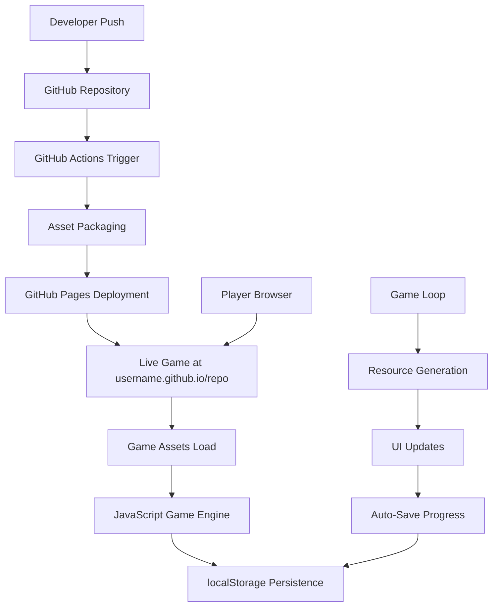

# Design Document

## Overview

The IdleCity Web Game is a browser-based idle/incremental game built with vanilla HTML5, CSS, and JavaScript. The game features automatic resource generation, building purchases, upgrades, and persistent progress storage. The entire system is designed for seamless deployment to GitHub Pages with automated CI/CD workflows, creating a complete development-to-production pipeline that requires no complex build processes.

The architecture emphasizes simplicity, performance, and maintainability while providing an engaging idle game experience. All game logic runs client-side with localStorage persistence, making it perfect for static hosting on GitHub Pages.

## Architecture

### High-Level Architecture



### Component Architecture

The system consists of three main architectural layers:

1. **Presentation Layer**: HTML structure and CSS styling with Tailwind utilities
2. **Game Logic Layer**: JavaScript modules handling game mechanics, state management, and UI updates
3. **Persistence Layer**: localStorage-based save system with error handling and data validation
4. **Deployment Layer**: GitHub Actions workflow for automated packaging and GitHub Pages deployment

## Components and Interfaces

### 1. HTML Structure (`index.html`)

**Core Layout Components**:
- Game header with title and version information
- Resource display panel showing current currencies and generation rates
- Building purchase interface with costs and owned quantities
- Upgrade system with unlock conditions and effects
- Settings panel for game options and save management

**Responsive Design**:
- Mobile-first approach with Tailwind CSS utilities
- Flexible grid layout adapting to different screen sizes
- Touch-friendly button sizes and spacing
- Accessible semantic HTML structure

### 2. CSS Styling System

**Tailwind CSS Integration**:
- Utility-first approach for rapid development
- Custom color palette for game theming
- Responsive breakpoints for mobile and desktop
- Component-based styling for reusable UI elements

**Visual Design Elements**:
- Consistent spacing and typography scale
- Hover and active states for interactive elements
- Progress bars and animated counters
- Visual feedback for user actions

### 3. JavaScript Game Engine

**Core Game Modules**:

```javascript
// Game State Management
const GameState = {
  resources: { coins: 0, population: 0 },
  buildings: { houses: 0, shops: 0, factories: 0 },
  upgrades: { efficiency: 1, automation: false },
  statistics: { totalClicks: 0, gameTime: 0 }
};

// Main Game Loop
const GameLoop = {
  tick: () => { /* Resource generation and UI updates */ },
  start: () => { /* Initialize game loop with setInterval */ },
  stop: () => { /* Pause game execution */ }
};

// Building System
const Buildings = {
  purchase: (type) => { /* Handle building purchases */ },
  getProduction: (type) => { /* Calculate resource generation */ },
  getCost: (type, quantity) => { /* Dynamic pricing calculation */ }
};
```

**Game Mechanics Implementation**:
- **Resource Generation**: Automatic increment based on buildings owned
- **Building System**: Purchase mechanics with increasing costs
- **Upgrade System**: Unlockable improvements affecting game progression
- **Achievement System**: Goals and milestones for player engagement

### 4. Persistence System

**localStorage Integration**:
- Automatic save every 10 seconds during gameplay
- Save on all significant game state changes
- Compressed JSON format for efficient storage
- Data validation and corruption recovery

**Save Data Structure**:
```javascript
const SaveData = {
  version: "1.0.0",
  timestamp: Date.now(),
  gameState: GameState,
  settings: { autoSave: true, notifications: true },
  statistics: { /* gameplay metrics */ }
};
```

### 5. User Interface System

**Dynamic UI Updates**:
- Real-time resource counter animations
- Building availability indicators
- Progress bars for upgrades and achievements
- Notification system for important events

**Interaction Handlers**:
- Click handlers for manual resource generation
- Purchase confirmation for expensive items
- Keyboard shortcuts for power users
- Touch gesture support for mobile devices

## Data Models

### Game State Model

```javascript
const GameStateSchema = {
  resources: {
    coins: Number,           // Primary currency
    population: Number,      // Secondary resource
    happiness: Number,       // Quality metric
    energy: Number          // Consumption resource
  },
  buildings: {
    houses: Number,         // Population generators
    shops: Number,          // Coin generators
    factories: Number,      // Advanced production
    parks: Number          // Happiness generators
  },
  upgrades: {
    efficiency: Number,     // Production multiplier
    automation: Boolean,    // Auto-purchase buildings
    research: Number,       // Unlock new features
    prestige: Number       // Meta-progression
  },
  statistics: {
    totalClicks: Number,
    gameTime: Number,
    buildingsPurchased: Number,
    prestigeCount: Number
  }
};
```

### Building Configuration Model

```javascript
const BuildingConfig = {
  houses: {
    name: "Houses",
    description: "Generate population over time",
    baseCost: 10,
    costMultiplier: 1.15,
    baseProduction: 1,
    resourceType: "population",
    unlockCondition: { coins: 0 }
  },
  shops: {
    name: "Shops",
    description: "Generate coins from population",
    baseCost: 50,
    costMultiplier: 1.20,
    baseProduction: 2,
    resourceType: "coins",
    unlockCondition: { population: 10 }
  }
};
```

## Error Handling

### Client-Side Error Management

**localStorage Failures**:
- Graceful degradation when localStorage is unavailable
- Temporary in-memory storage as fallback
- User notification about save limitations
- Automatic retry mechanisms for transient failures

**Game State Corruption**:
- Data validation on load with schema checking
- Automatic backup creation before major updates
- Reset to last known good state on corruption
- User-friendly error messages with recovery options

**Performance Issues**:
- Frame rate monitoring and automatic optimization
- Memory usage tracking and cleanup
- Efficient DOM updates using document fragments
- Debounced save operations to prevent excessive writes

### Deployment Error Handling

**GitHub Actions Failures**:
- Basic retry logic using peaceiris/actions-gh-pages
- Simple error logging and GitHub Actions status reporting
- Manual rollback through Git revert if needed
- Basic deployment status notifications

**Asset Validation**:
- Simple file existence checks for required assets
- Basic HTML/CSS/JS syntax validation
- Manual verification of deployed site functionality

## Testing Strategy

### Smoke & Sanity Checks

**Simple Console Testing**:
- Basic assertions in script.js for core game functions
- Console.log validation for resource calculations and save/load
- Manual browser testing for UI functionality
- Simple error logging for debugging

**Deployment Health Checks**:
- Basic curl 200 OK status check in GitHub Actions
- Simple asset existence verification
- Manual smoke test after deployment
- Error monitoring through browser console

## Implementation Phases

### Phase 1: Core Game Foundation
- Basic HTML structure with game containers
- Essential CSS styling with Tailwind utilities
- Core JavaScript game loop and state management
- Basic resource generation and building system

### Phase 2: Enhanced Gameplay
- Complete building and upgrade systems
- Achievement and milestone tracking
- Advanced UI animations and feedback
- Comprehensive save/load functionality

### Phase 3: Deployment Automation
- GitHub Actions workflow creation
- Asset packaging and optimization
- GitHub Pages deployment configuration
- Error handling and monitoring

### Phase 4: Polish and Future Enhancements
- Performance optimization and advanced testing (Jest, Playwright)
- Service Worker implementation for PWA functionality
- Advanced accessibility improvements
- CDN integration and advanced caching strategies

## Security Considerations

### Client-Side Security
- Input validation for all user interactions
- XSS prevention in dynamic content generation
- Safe JSON parsing with error handling
- Secure localStorage usage patterns

### Deployment Security
- GitHub Actions secrets management
- Repository access controls and permissions
- Automated security scanning for dependencies
- Content Security Policy implementation

## Performance Optimization

### Game Performance
- Efficient game loop with requestAnimationFrame
- Optimized DOM updates using virtual DOM concepts
- Memory management and garbage collection awareness
- Lazy loading for non-critical game features

### Web Performance
- Simple asset optimization (basic minification)
- Efficient CSS with Tailwind utilities
- Optimized images and icons
- Browser cache + localStorage for offline experience

## Accessibility Features

### WCAG Compliance
- Semantic HTML structure with proper headings
- ARIA labels and descriptions for interactive elements
- Keyboard navigation support for all functionality
- High contrast color schemes and readable fonts

### Inclusive Design
- Scalable text and UI elements
- Alternative text for visual elements
- Screen reader compatibility
- Reduced motion options for sensitive users